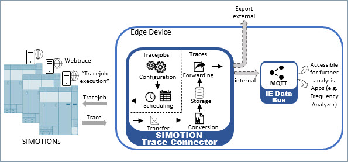

# Creating tracejobs in SIMOTION Trace connector

How to configure and execute tracejobs via web-based SIMOTION Trace connector application.

* [Tracejobs configuration and execution](#trace-connector-tutorial)
  * [Description](#description)
    * [Overview](#overview)
    * [General Task](#general-task)
  * [Requirements](#requirements)
  * [Installation](#installation)
  * [Usage](#usage)
  * [Documentation](#documentation)
  * [Contribution](#contribution)
  * [Licence and Legal Information](#licence-and-legal-information)

## Description

### Overview

SIMOTION Trace connector is a web-based application running on SIEMENS Industrial Edge 

### General Task

This tutorial was created to help user to configure and execute tracejobs via the SIMOTION
webserver interface and download the recorded traced data to the Edge device.

## Requirements

For the SIMOTION Trace connector application the following requirements are necessary:

* The WebServer of the SIMOTION needs to be activated. This also enables automatically the used OPC XML DA protocol. 
* Open port 80 for Webserver and OPC XML DA
* SIMOTION Firmware Version V4.1 or newer 
* Industrial Edge Device with RT V1 or higher
  * Device license: 6ES7823-0EE00-4AY0
  * Device: 6ES7647-8BD31-0CW1
  
**Notice:** the app is currently not running on WinCC Comfort Panels with integrated Edge functionality

## Installation

To install SIMOTION Trace connector on your Edge device, you need to request application example. 
It can be done using the link provided below. This link opens a request form. 

Since it is a generic form please type in the name of the application that you request, the contact information of your local Siemens representative or distributor and your corporate email (cc email box).

[Request application](https://siemens.sharepoint.com/teams/P0016970/Lists/APCApp/NewForm.aspx?Source=https://support.industry.siemens.com/cs/products?dtp=ExampleOfUse&mfn=ps&lc=en-EN) 

## Usage

When the app is installed, it offers the following functionality:

* Definition of tracejobs (variables, trace duration, trigger condition)
* Automatic execution and scheduling of the tracejobs
* Remanet storage of the trace results
* Visualization of the trace data
* Publishing of the trace results via MQTT data bus
* External triggering and status monitoring of the tracejobs via MQTT

## Documentation

Application functionality and user scenarios are detailed in user documentation.

[User documentation](docs/documentation/TraceConnector_documentation.pdf)

You can also find further documentation and help in the following links:

* [Industrial Edge Hub](https://iehub.eu1.edge.siemens.cloud/#/documentation)
* [Industrial Edge Forum](https://www.siemens.com/industrial-edge-forum)
* [Industrial Edge landing page](https://new.siemens.com/global/en/products/automation/topic-areas/industrial-edge/simatic-edge.html)
* [Industrial Edge GitHub page](https://github.com/industrial-edge)

## Contribution

Thank you for your interest in contributing. Anybody is free to report bugs, unclear documentation, and other problems regarding this repository in the Issues section. Everybody is free to propose any changes to this repository using Pull Requests.

## Licence and Legal Information

Please read the [Legal information](LICENSE.md).
